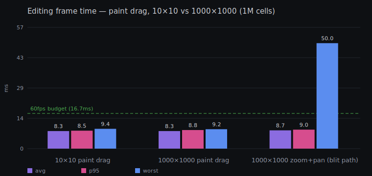
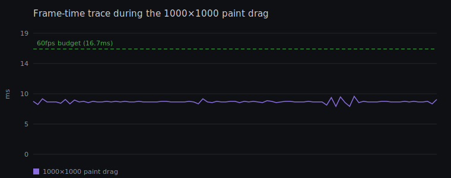
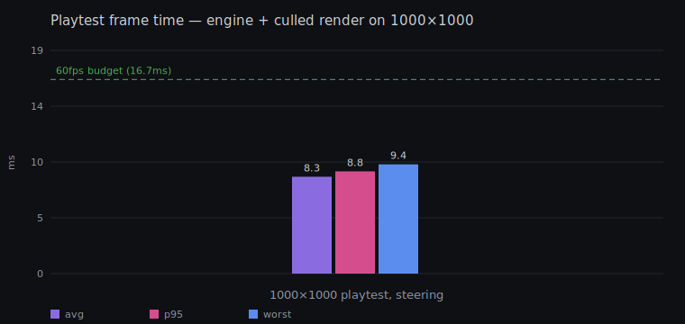

# Performance evidence

Generated by `bun run perf` (headless Chromium 1440×900, frame times from
requestAnimationFrame deltas). The 60fps budget line is 16.7ms.

| Scenario | Result |
| --- | --- |
| 10×10 paint drag | avg 8.3 / p95 8.5 / worst 9.4 ms (88 frames) |
| 1000×1000 paint drag | avg 8.3 / p95 8.8 / worst 9.2 ms (89 frames) |
| 1000×1000 zoom + pan (overview blit) | avg 8.7 / p95 9.0 / worst 50.0 ms (291 frames) |
| 1000×1000 playtest, steering | avg 8.3 / p95 8.8 / worst 9.4 ms (597 frames) |

The zoom scenario's worst frame is a single one-time cost: entering the
far-zoom blit path after edits flushes the overview bitmap once
(`putImageData` of a 1MP ImageData); every following frame is a plain scaled
`drawImage`.

Raw numbers: [data.json](data.json). Regenerate with `bun run perf`
(ports 8000/3001 must be free; `bunx playwright install chromium` once).
